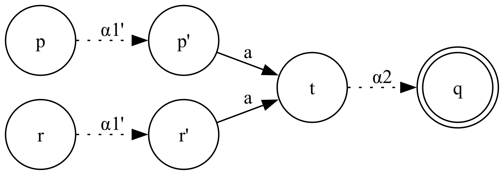
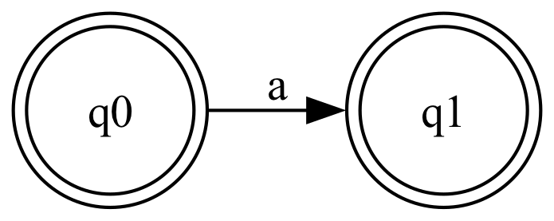

# Teoría de Lenguajes

Preguntas de final Julio 2024.

## Ejercicio 1

**Dar un algoritmo que decida si dos expresiones regulares denotan el mismo lenguaje. Justificar la correctitud. Analizar la complejidad computacional de peor caso.**

Sean $e$ y $f$ expresiones regulares. Construimos $M_e$ y $M_f$ AFDs a partir de cada expresión regular tal que $\mathcal{L}(M_e) = e$ y $\mathcal{L}(M_f) = f$.

**Opción 1**: comparar autómatas mínimos.

1. Calculamos $M_e'$ y $M_f'$ AFDs mínimos de $M_e$ y $M_f$ respectivamente.
2. Revisamos si $M_e' = M_f'$ salvo isomorfismo.

Complejidad $O(ns \text{ log } n)$ para minimizar los autómatas ($n$ cantidad de estados, $s$ símbolos del alfabeto).

**Opción 2**: por Lema de Pumping.

$M_e = \langle Q_e, \Sigma, \delta_e, q_0, F_e \rangle$ \
$M_f = \langle Q_f, \Sigma, \delta_f, p_0, F_f \rangle$

Tomamos $p = \text{max}(2|Q_e|-1, 2|Q_f|-1)$. Para toda cadena $w \in \Sigma^{\leq p}$ verificamos que se cumpla:

$\hat\delta_e(q_0, w) \in F_e \iff \hat\delta_f(p_0, w) \in F_f$

Por Lema de Pumping, si se cumple para todas las cadenas de longitud $\leq p$ entonces ambos autómatas reconocen el mismo lenguaje. Estas son todas las cadenas más chicas que pertenecen al languaje, y cualquier cadena de longitud mayor se obtiene pumpeando estas cadenas.

Cantidad de cadenas a revisar: $|\Sigma^{\leq p}| = \sum_{i=0}^p s^i = \frac{s^{p+1} - 1}{s - 1}$ son $s = |\Sigma|$.

**Opción 3**: por diferencia simétrica.

$\mathcal{L}(M_e) \Delta \mathcal{L}(M_f) = \emptyset$ \
$\iff \mathcal{L}(M_e) \cap \overline{\mathcal{L}(M_f)} = \emptyset \land \overline{\mathcal{L}(M_e)} \cap \mathcal{L}(M_f) = \emptyset$ \
$\iff \mathcal{L}(M_e) = \mathcal{L}(M_f)$

1. Construimos los AFDs $A_1$ y $A_2$ tales que $\mathcal{L}(A_1) = \mathcal{L}(M_e) \cap \overline{\mathcal{L}(M_f)}$ y $\mathcal{L}(A_2) = \overline{\mathcal{L}(M_e)} \cap \mathcal{L}(M_f)$.
2. Verificamos si $\mathcal{L}(A_1) = \emptyset$ y $\mathcal{L}(A_2) = \emptyset$, por ejemplo viendo que ningún estado final es alcanzable desde el estado inicial con DFS/BFS.

## Ejercicio 2

**Dar dos algoritmos distintos para determinar si el lenguaje aceptado por un autómata finito dado es el conjunto de todas las cadenas del alfabeto. Justificar cada uno y dar su complejidad algorítmica.**

Sea $M$ un autómata finito cualquiera. QVQ: $\mathcal{L}(M) = \Sigma^\ast$.

**Opción 1**

1. Determinizamos y minimizamos $M$ para obtener $M'$ AFD mínimo.
2. Revisamos si $M'$ contiene un único estado final, con transiciones a sí mismo para todos los símbolos del alfabeto.

**Opción 2**

Notemos que $\mathcal{L}(M) = \Sigma^\ast \iff \overline{\mathcal{L}(M)} = \emptyset$.

1. Construimos $M^c$ AFD tal que $\mathcal{L}(M^c) = \overline{\mathcal{L}(M)}$.
2. Revisamos si $\mathcal{L}(M^c) = \emptyset$.

## Ejercicio 3

**Dar un algoritmo que determine si un lenguaje regular dado es infinito. Justificar y dar la complejidad del algoritmo en el peor caso.**

Construimos $M = \langle Q, \Sigma, \delta, q_0, F \rangle$ AFD tal que reconoce el lenguaje regular dado. Por Lema de Pumping, $\mathcal{L}(M)$ es infinito si y solo si existe $w \in \Sigma^\ast$ tal que $\hat\delta(q_0, w) \in F$ y $n \leq |w| < 2n$ con $n = |Q|$.

Si existe tal cadena $w$ aceptada por $M$, entonces necesariamente se utiliza un ciclo de $M$ para aceptarla, pues $|w| \geq n$ y hay solo $n$ estados en $M$. Por lo tanto, por el Lema de Pumping podemos pumpear una cantidad arbitraria de veces la subcadena aceptada por el ciclo. Dicho de otra forma, podemos recorrer el ciclo una cantidad arbitraria de veces antes de continuar hacia el estado final, aceptando así cadenas arbitrariamente grandes. Luego $\mathcal{L}(M)$ resulta infinito.

El algoritmo consistente en probar una por una las cadenas $w \in \Sigma^\ast$ tal que $n \leq |w| < 2n$ hasta encontrar una que sea aceptada por $M$. En tal caso frenamos y respondemos que $\mathcal{L}(M)$ es infinito. Si probamos todas las cadenas y ninguna es aceptada, entonces respondemos que $\mathcal{L}(M)$ no es infinito.

Basta con encontrar una única cadena $w$ (pueden haber más). En el peor caso terminamos probando todas las cadenas: $\sum_{i=n}^{i=2n} |\Sigma|^i$.

## Ejercicio 4

**¿Cuántos autómatas finitos determinísticos con dos estados pueden construirse sobre el alfabeto {0, 1}?**

La cantidad de funciones de transición $\delta: Q \times \Sigma \rightarrow Q$ que podemos construir son:

- $|Q \times \Sigma| = |Q| \ast |\Sigma| = 2 \ast 2 = 4$
- $|Q| = 2$

Por cada uno de los $4$ elementos del dominio de $\delta$ hay $2$ posibles asignaciones. Luego hay $2^4 = 16$ funciones $\delta$ distintas. Al ser un AFD el formalismo requiere que el autómata sea completo (todos los estados deben tener transiciones para todos los símbolos del alfabeto).

Ahora contamos las posibles configuraciones de estados iniciales y finales:

- $2$ opciones para estado inicial.
- $2^{|Q|} = 2^2 = 4$ opciones para configuración de estados finales. Hay $2$ estados y cada uno puede o no ser final. Otra forma de pensarlo es: $F \in \mathcal{P}(Q)$ (el conjunto $F$ de estados finales pertenece a partes de $Q$), y $|\mathcal{P}(Q)| = 2^{|Q|} = 4$ (hay 4 posibles conjuntos $F$).

Entonces en total existen $16 \ast 2 \ast 4 = 128$ autómatas distintos. Muchos de estos autómatas son isomorfos y reconocen el mismo lenguaje, pero el enunciado solo pide contar autómatas (sin mencionar el lenguaje generado).

En general esta cuenta se obtiene así: $|Q|^{|Q|\ast|\Sigma|} \ast |Q| \ast 2^{|Q|} = |Q|^{|Q|\ast|\Sigma|+1} \ast 2^{|Q|}$.

**¿Cuántos autómatas finitos no determinísticos con dos estados pueden construirse sobre el alfabeto {0, 1}?**

La cuenta es parecida a la pregunta anterior. Lo que cambia es que en un AFND la función de transición tiene como codominio a $\mathcal{P}(Q)$, y entonces la cantidad de funciones de transición $\delta: Q \times \Sigma \rightarrow \mathcal{P}(Q)$ que podemos construir son: $|\mathcal{P}(Q)| ^ {|Q| \ast |\Sigma|}$.

La forma de contar las configuraciones de estados iniciales y finales es la misma. La fórmula general resulta: $|\mathcal{P}(Q)| ^ {|Q| \ast |\Sigma|} \ast |Q| \ast 2^{|Q|}$.

Para el caso puntual del enunciado:

- $|Q| = 2$
- $|\Sigma| = 2$
- $(2^2) ^ {2 \ast 2} \ast 2 \ast 2^{2} = 2048$

**¿Cuántos autómatas de pila con dos estados pueden construirse con alfabeto de entrada $\Sigma$, alfabeto de pila $\Gamma$, y una cantidad máxima de $M$ símbolos en cada transición?**

Contamos la cantidad de funciones de transición $\delta: Q \times (\Sigma \cup \{ \lambda \}) \times \Gamma \rightarrow \mathcal{P}(Q \times \Gamma^{\leq M})$. Notar el codominio de la función donde restringimos la cadena a escribir en la pila a $\Gamma^{\leq M}$ pues por enunciado se escriben como máximo $M$ símbolos.

- $|Q \times (\Sigma \cup \{ \lambda \}) \times \Gamma| = |Q| \ast (|\Sigma|+1) \ast |\Gamma|$
- $|\mathcal{P}(Q \times \Gamma^{\leq M})| = 2 ^ {|Q| \ast |\Gamma^{\leq M}|} = 2 ^ {|Q| \ast Z}$ con $Z = |\Gamma^{\leq M}| = \Sigma_{i=0}^{i=M} |\Gamma|^i$

La forma de contar las configuraciones de estados iniciales y finales es la misma que en las preguntas anteriores.

Asumiendo que el símbolo de inicio de la pila está fijo la fórmula es: $(2 ^ {|Q| \ast Z}) ^ {|Q| \ast (|\Sigma|+1) \ast |\Gamma|} \ast |Q| \ast 2^{|Q|}$.

Si queremos incluir la cantidad de símbolos distintos que podríamos usar para el inicio de la pila entonces: $(2 ^ {|Q| \ast Z}) ^ {|Q| \ast (|\Sigma|+1) \ast |\Gamma|} \ast |Q| \ast 2^{|Q|} \ast |\Gamma|$.

## Ejercicio 7

**Demostrar que si un autómata finito es determinístico, accesible, coaccesible y codeterminístico entonces es mínimo.**

- Accesible: Todos los estados son accesibles desde el estado inicial.
- Coaccesible: Todos los estados tienen un camino en el autómata hasta un estado final.
- Codeterminístico: hay un único estado final y no hay transiciones $\delta(p, a) = q$ y $\delta(r, a) = q$.

Sea $M = \langle Q, \Sigma, \delta, q_0, F \rangle$.

Por el contrarrecíproco, si $M$ no es mínimo entonces no es determinístico, o no es accesible, o no es coaccesible, o no es codeterminístico. Veamos cada caso.

**$M$ no es mínimo entonces no es determinístico**.

Por definición, un autómata mínimo es necesariamente determinístico. Por lo tanto, si $M$ no es mínimo entonces podría no ser determinístico.

**$M$ no es mínimo entonces no es accesible**.

Si $M$ no es mínimo entonces podría tener un estado $p \in Q$ inalcanzable desde $q_0$. Al ser inalcanzable desde el estado inicial, se podría eliminar $p$ sin modificar el lenguaje aceptado, y por eso $M$ no es mínimo.

Formalmente, para toda cadena $\alpha \in \Sigma^\ast$, $\hat\delta(q_0, \alpha) \neq p$. Luego $M$ no es accesible.

**$M$ no es mínimo entonces no es coaccesible**.

Si $M$ no es mínimo entonces podría tener un estado $p \in Q$ desde el cual no exista ningún camino hacia un estado final. La existencia de tal estado implica que $M$ no es mínimo porque los caminos que llevan a $p$ se podrían eliminar de $M$ sin modificar el lenguaje aceptado (ya que desde $p$ no se puede llegar a ningún estado final).

Formalmente, para toda cadena $\alpha \in \Sigma^\ast$, $\hat\delta(p, \alpha) \notin F$. Luego $M$ no es coaccesible.

**$M$ no es mínimo entonces no es codeterminístico**.

Si $M$ no es mínimo entonces existen 2 estados diferentes $p,r \in Q$ que son indistinguibles.

Para toda cadena $\alpha \in \Sigma^\ast$, $\hat\delta(p, \alpha) \in F \iff \hat\delta(r, \alpha) \in F$.

Sin pérdida de generalidad, tomemos una cadena $\alpha \in \Sigma^\ast$ cualquiera y sean $q_1, q_2 \in F$ tales que $\hat\delta(p, \alpha) = q_1$ y $\hat\delta(r, \alpha) = q_2$.

Caso $q_1 \neq q_2$

Si los estados finales son distintos entonces $|F| \geq 2 \neq 1$. Luego $M$ no es codeterminístico.

Caso $q_1 = q_2$

Si los estados finales son iguales, llamemos $q = q_1 = q_2$. Notemos que $p \neq r$, por lo tanto tenemos 2 caminos que empiezan en estados distintos pero terminan en el mismo estado final. Esto solo sucede si los 2 caminos se juntan en algún momento (y esto implica que $M$ no es codeterminístico).

Descomponemos $\alpha$ en 2 partes: $\alpha = \alpha_1 \alpha_2$ tal que $t \in Q$ es el estado en donde se unen los 2 caminos luego de consumir $\alpha_1$.

$\hat\delta(p, \alpha_1 \alpha_2) = q \hspace{1em} \Rightarrow \hspace{1em} (p, \alpha_1 \alpha_2) \vdash^\ast (t, \alpha_2) \vdash^\ast(q, \lambda) \hspace{1em} \Rightarrow \hspace{1em} \hat\delta(p, \alpha_1) = t$ \
$\hat\delta(r, \alpha_1 \alpha_2) = q \hspace{1em} \Rightarrow \hspace{1em} (r, \alpha_1 \alpha_2) \vdash^\ast (t, \alpha_2) \vdash^\ast(q, \lambda) \hspace{1em} \Rightarrow \hspace{1em} \hat\delta(r, \alpha_1) = t$

Luego $M$ no es codeterminístico.

Nota: Extendimos la definición de codeterminismo para $\hat\delta$. De ser necesario, podemos hacer un paso más para llevar el resultado anterior a la definición de codeterminismo dada.

Sea $\alpha_1 = \alpha_1'a$ con $a \in \Sigma$. Sean $p', r' \in Q$.

$\hat\delta(p, \alpha_1) = t \hspace{1em} \Rightarrow \hspace{1em} \hat\delta(p, \alpha_1'a) = t \hspace{1em} \Rightarrow \hspace{1em} (p, \alpha_1'a) \vdash^\ast (p', a) \vdash (t, \lambda) \hspace{1em} \Rightarrow \hspace{1em} \delta(p', a) = t$ \
$\hat\delta(r, \alpha_1) = t \hspace{1em} \Rightarrow \hspace{1em} \hat\delta(r, \alpha_1'a) = t \hspace{1em} \Rightarrow \hspace{1em} (r, \alpha_1'a) \vdash^\ast (r', a) \vdash (t, \lambda) \hspace{1em} \Rightarrow \hspace{1em} \delta(r', a) = t$

**Demostrar que la recíproca de la afirmación anterior no siempre es cierta.**

El autómata $M$ tal que $\mathcal{L}(M) = \{ \lambda, a \}$ tiene 2 estados finales. Por lo tanto no es codeterminístico, sin embargo es mínimo.

## Ejercicio 8

**Dar un algoritmo que dado un autómata finito que reconoce un lenguaje infinito, lo transforma en otro que reconoce el mismo lenguaje y tiene al menos el doble de estados que el mínimo. Demostrar que el algoritmo es correcto.**

Sea $M = \langle Q, \Sigma, \delta, q_0, F \rangle$ tal que $\mathcal{L}(M)$ es infinito. Construimos $M' = \langle Q', \Sigma, \delta', q_0', F' \rangle$ AFD mínimo tal que $\mathcal{L}(M') = \mathcal{L}(M)$.

Para simplificar los chirimbolos consideramos $M = \langle Q, \Sigma, \delta, q_0, F \rangle$ como el AFD mínimo.

Por Lema de Pumping, como $\mathcal{L}(M)$ es infinito entonces existe una cadena $w \in \Sigma^\ast$ tal que $w \in \mathcal{L}(M)$ y $n \leq |w| < 2n$ con $n = |Q|$ (cantidad de estados del AFD mínimo).

Sea $w = a_1 \dots a_m$ con $m \geq n$. Para aceptar $w$ necesariamente usamos $m$ transiciones y pasamos por $m+1 > n$ estados. Por lo tanto hay un estado por el cual pasamos al menos 2 veces ya que hay solo $n$ estados.

Sea $q_{l_0}, \dots, q_{l_m}$ con $q_{l_0} = q_0$ y $q_{l_m} \in F$ la sucesión de estados desde $q_0$ para aceptar la cadena $w$. Como hay un estado por el cual pasamos al menos 2 veces, existen $0 \leq j < k \leq n$ mínimos tal que $q_{l_j} = q_{l_k}$. Hay solo $n$ estados, entonces a lo sumo visitamos cada estado 1 vez antes de repetir algún estado ya visitado. Al tomar $j,k$ mínimos, el máximo valor posible de $k$ es $n$. En esencia estamos localizando el ciclo más cercano a $q_0$.

El camino que acepta $w$ tiene 3 partes claramente delimitadas: antes del ciclo, el ciclo, después del ciclo. Esto genera una descomposición de $w$ (es la misma que la del Lema de Pumping): $w = xyz$ con $x = a_1 \dots a_j$, $y = a_{j+1} \dots a_k$, $z = a_{k+1}, \dots, a_m$.

Para agregar $n$ estados nuevos y mantener el mismo lenguaje, podemos "[unrollear](https://en.wikipedia.org/wiki/Loop_unrolling)" el ciclo tantas veces como sea necesario. La idea es agrandar el ciclo que acepta $y$ para que acepte $y^n$. Como mínimo el ciclo tiene un único estado ($|y| = 1$), así que $y^n$ en efecto agrega por lo menos $n$ estados al autómata.

Ahora tenemos que arreglar algunas cosas para que acepte el mismo lenguaje. Por Lema de Pumping ya sabíamos que $w = xy^iz \in \mathcal{L}(M')$ con $i \geq 0$. Al agrandar el ciclo solo tenemos garantizado que $xy^iz \in \mathcal{L}(M')$ con $i \equiv 0$ módulo $n$. Necesitamos poder salir del ciclo a mitad de camino, en particular cada vez que aceptamos un $y$.

Sean $p_0, \dots, p_n$ los estados dentro del ciclo tales que $\hat\delta(p_i, y) = p_{i+1}$. En particular $p_0 = q_{l_j}$ y $p_n = q_{l_k}$. Podríamos agregar transiciones $\lambda$ hacia $q_{l_k}$ desde cada uno de los $p_i$, es decir $\hat\delta(p_i, \lambda) = q_{l_k}$. Esto construye un AFND-$\lambda$, pero se puede construir un AFD de la siguiente forma.

Extendemos el autómata para conectar cada $p_i$ con todos los posibles caminos de aceptación desde $q_{l_k}$. Agregamos estados y transiciones necesarias tal que para todo $\alpha \in \Sigma^\ast$, $\hat\delta(q_{l_k}, \alpha) \in F$ sii $\hat\delta(p_i, \alpha) \in F$. Notar que podría ser $\alpha = z$ pero también podrían ser otras cadenas.

**Otra idea**: Si el autómata resultante puede ser AFND-$\lambda$, entonces se pueden partir todos los estados en 2 con una transición $\lambda$ que los une.

Sea $M = \langle Q, \Sigma, \delta, q_0, F \rangle$ AFD mínimo, y sea $M' = \langle Q', \Sigma, \delta', q_0', F' \rangle$ tal que $|Q'| \geq 2|Q|$.

Para todo $q \in Q$ agregamos $q_{in}, q_{out} \in Q'$ en el nuevo autómata y actualizamos las transiciones de todos los $q \in Q$ para que llegan a $q_{in}$ y salgan de $q_{out}$. Para todo $q,p \in Q$, $\delta(p, a) = q$ sii $\delta(p_{out}, a) = q_{in}$.

Luego conectamos $q_{in}$ y $q_{out}$ con una transición $\lambda$. Para todo $q_{in} \in Q'$, $\delta(q_{in}, \lambda) = q_{out}$.

Finalmente definimos $q_0' = q_{0_{in}}$ y $F' = \{ q_{in} \mid q \in F \}$.
