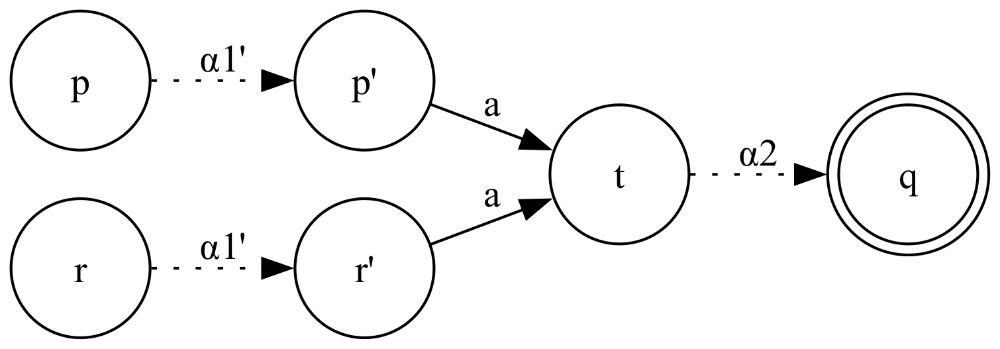
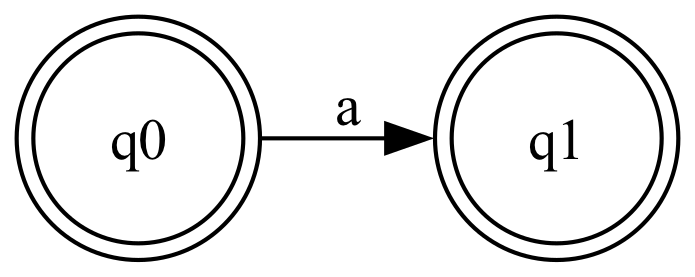

## Ejercicio 7

**Demostrar que si un autómata finito es determinístico, accesible, coaccesible y codeterminístico entonces es mínimo.**

- Accesible: Todos los estados son accesibles desde el estado inicial.
- Coaccesible: Todos los estados tienen un camino en el autómata hasta un estado final.
- Codeterminístico: hay un único estado final y no hay transiciones $\delta(p, a) = q$ y $\delta(r, a) = q$.

Sea $M = \langle Q, \Sigma, \delta, q_0, F \rangle$.

Por el contrarrecíproco, si $M$ no es mínimo entonces no es determinístico, o no es accesible, o no es coaccesible, o no es codeterminístico. Veamos cada caso.

**$M$ no es mínimo entonces no es determinístico**.

Por definición, un autómata mínimo es necesariamente determinístico. Por lo tanto, si $M$ no es mínimo entonces podría no ser determinístico.

**$M$ no es mínimo entonces no es accesible**.

Si $M$ no es mínimo entonces podría tener un estado $p \in Q$ inalcanzable desde $q_0$. Al ser inalcanzable desde el estado inicial, se podría eliminar $p$ sin modificar el lenguaje aceptado, y por eso $M$ no es mínimo.

Formalmente, para toda cadena $\alpha \in \Sigma^\ast$, $\hat\delta(q_0, \alpha) \neq p$. Luego $M$ no es accesible.

**$M$ no es mínimo entonces no es coaccesible**.

Si $M$ no es mínimo entonces podría tener un estado $p \in Q$ desde el cual no exista ningún camino hacia un estado final. La existencia de tal estado implica que $M$ no es mínimo porque los caminos que llevan a $p$ se podrían eliminar de $M$ sin modificar el lenguaje aceptado (ya que desde $p$ no se puede llegar a ningún estado final).

Formalmente, para toda cadena $\alpha \in \Sigma^\ast$, $\hat\delta(p, \alpha) \notin F$. Luego $M$ no es coaccesible.

**$M$ no es mínimo entonces no es codeterminístico**.

Si $M$ no es mínimo entonces existen 2 estados diferentes $p,r \in Q$ que son indistinguibles.

Para toda cadena $\alpha \in \Sigma^\ast$, $\hat\delta(p, \alpha) \in F \iff \hat\delta(r, \alpha) \in F$.

Sin pérdida de generalidad, tomemos una cadena $\alpha \in \Sigma^\ast$ cualquiera y sean $q_1, q_2 \in F$ tales que $\hat\delta(p, \alpha) = q_1$ y $\hat\delta(r, \alpha) = q_2$.

Caso $q_1 \neq q_2$

Si los estados finales son distintos entonces $|F| \geq 2 \neq 1$. Luego $M$ no es codeterminístico.

Caso $q_1 = q_2$

Si los estados finales son iguales, llamemos $q = q_1 = q_2$. Notemos que $p \neq r$, por lo tanto tenemos 2 caminos que empiezan en estados distintos pero terminan en el mismo estado final. Esto solo sucede si los 2 caminos se juntan en algún momento (y esto implica que $M$ no es codeterminístico).

Descomponemos $\alpha$ en 2 partes: $\alpha = \alpha_1 \alpha_2$ tal que $t \in Q$ es el estado en donde se unen los 2 caminos luego de consumir $\alpha_1$.

$\hat\delta(p, \alpha_1 \alpha_2) = q \hspace{1em} \Rightarrow \hspace{1em} (p, \alpha_1 \alpha_2) \vdash^\ast (t, \alpha_2) \vdash^\ast(q, \lambda) \hspace{1em} \Rightarrow \hspace{1em} \hat\delta(p, \alpha_1) = t$ \
$\hat\delta(r, \alpha_1 \alpha_2) = q \hspace{1em} \Rightarrow \hspace{1em} (r, \alpha_1 \alpha_2) \vdash^\ast (t, \alpha_2) \vdash^\ast(q, \lambda) \hspace{1em} \Rightarrow \hspace{1em} \hat\delta(r, \alpha_1) = t$

Luego $M$ no es codeterminístico.

Nota: Extendimos la definición de codeterminismo para $\hat\delta$. De ser necesario, podemos hacer un paso más para llevar el resultado anterior a la definición de codeterminismo dada.

Sea $\alpha_1 = \alpha_1'a$ con $a \in \Sigma$. Sean $p', r' \in Q$.

$\hat\delta(p, \alpha_1) = t \hspace{1em} \Rightarrow \hspace{1em} \hat\delta(p, \alpha_1'a) = t \hspace{1em} \Rightarrow \hspace{1em} (p, \alpha_1'a) \vdash^\ast (p', a) \vdash (t, \lambda) \hspace{1em} \Rightarrow \hspace{1em} \delta(p', a) = t$ \
$\hat\delta(r, \alpha_1) = t \hspace{1em} \Rightarrow \hspace{1em} \hat\delta(r, \alpha_1'a) = t \hspace{1em} \Rightarrow \hspace{1em} (r, \alpha_1'a) \vdash^\ast (r', a) \vdash (t, \lambda) \hspace{1em} \Rightarrow \hspace{1em} \delta(r', a) = t$

**Demostrar que la recíproca de la afirmación anterior no siempre es cierta.**

El autómata $M$ tal que $\mathcal{L}(M) = \{ \lambda, a \}$ tiene 2 estados finales. Por lo tanto no es codeterminístico, sin embargo es mínimo.

