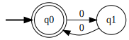
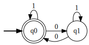
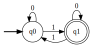
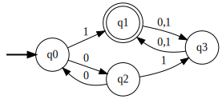
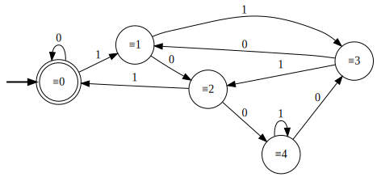

# Práctica 2 / Ejercicio 1

**a)** Cadenas sobre $\Sigma = \{ 0 \}$ de longitud par.

**b)** Cadenas sobre $\Sigma = \{ 0,1 \}$ con cantidad par de ceros.

**c)** Cadenas sobre $\Sigma = \{ 0,1 \}$ con cantidad impar de unos.

**d)** Cadenas sobre $\Sigma = \{ 0,1 \}$ con cantidad par de ceros y cantidad impar de unos.

**e)** Cadenas sobre $\Sigma = \{ 0,1 \}$ que, interpretadas como un número binario, sean congruentes a cero módulo 5.

Dada la representación binaria de un número $x$, veamos cómo se modifica su congruencia módulo 5 al agregar un dígito binario al final.

$\rightarrow_0$ Agregar un 0 multiplica a $x$ por 2. \
$\rightarrow_1$ Agregar un 1 multiplica a $x$ por 2 y suma 1.

Tenemos que analizarlo para cada congruencia módulo 5.

$x \equiv_5 0$ \
$\rightarrow_0 \hspace{2em} 2x \equiv_5 0$ \
$\rightarrow_1 \hspace{2em} 2x + 1 \equiv_5 1$

$x \equiv_5 1$ \
$\rightarrow_0 \hspace{2em} 2x \equiv_5 2$ \
$\rightarrow_1 \hspace{2em} 2x + 1 \equiv_5 3$

$x \equiv_5 2$ \
$\rightarrow_0 \hspace{2em} 2x \equiv_5 4$ \
$\rightarrow_1 \hspace{2em} 2x + 1 \equiv_5 0$

$x \equiv_5 3$ \
$\rightarrow_0 \hspace{2em} 2x \equiv_5 1$ \
$\rightarrow_1 \hspace{2em} 2x + 1 \equiv_5 2$

$x \equiv_5 4$ \
$\rightarrow_0 \hspace{2em} 2x \equiv_5 3$ \
$\rightarrow_1 \hspace{2em} 2x + 1 \equiv_5 4$

Asumimos que $\lambda \equiv_5 0$ para aceptar el estado inicio $\equiv 0$.

