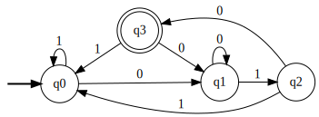
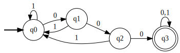
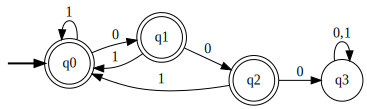
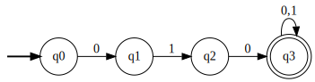

# Práctica 2 / Ejercicio 2

$\Sigma = \{ 0,1 \}$

**a)** Cadenas que comiencen con 010.

**b)** Cadenas que terminen con 010.

**c)** Cadenas que contengan la subcadena 000.

**d)** Cadenas que no contengan la subcadena 000.

**e)** Cadenas que contengan la subcadena 000 exactamente una vez (la cadena 0000 no pertenece a este lenguaje).

Empezamos por el autómata del inciso c que acepta las cadenas que contienen 000, y desde su estado final q3 pueden pasar 2 cosas:
- Si leemos un 0 nos vamos al estado trampa qt y nunca aceptamos.
- Si leemos un 1 enganchamos con el autómata del inciso d que acepta cadenas que no contienen 000.

**f)** Cadenas que no contengan la subcadena 000 ni la 010.

<!--  -->
