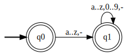
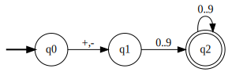
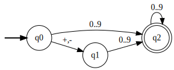
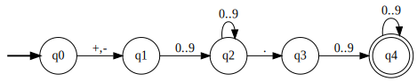
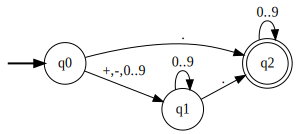
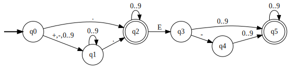

# Práctica 2 / Ejercicio 3

**a)** Identificadores de cualquier longitud que comiencen con una letra o guión y contengan letras, dígitos o guiones.

**b)** Constantes enteras con signo.

**c)** Constantes enteras con signo opcional.

**d)** Constantes reales con signo. Ejemplos: +123.456, -55.0, +00.430.

**e)** Constantes reales con signo opcional y partes enteras y fraccionarias opcionales. Ejemplos: los anteriores más 123.456, -55., +.43.

**f)** Constantes reales con notación exponencial opcional. Ejemplos: los anteriores más -55.E5, +.43E-6

