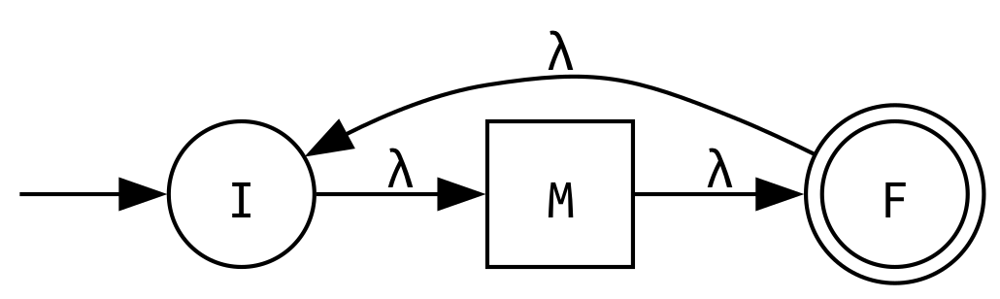
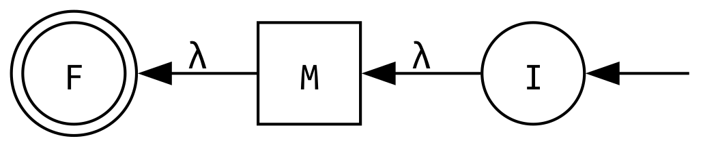

# Práctica 2 / Ejercicio 4

**a)** $\mathcal{L}^c$, el complemento de $\mathcal{L}$

Dado un autómata finito $M = (Q, \Sigma, \delta, q_0, F)$, primero nos aseguramos que esté completo. Tienen que estar todos los estados y todas las transiciones para cada símbolo del alfabeto (quizás haya que agregar un estado trampa si no lo tiene).

Luego, podemos construir otro autómata finito $M' = (Q, \Sigma, \delta, q_0, F')$ donde $F' = Q \setminus F$.

Al invertir los estados finales, las cadenas que acepta $M$ no se aceptan en $M'$, y viceversa, logrando así que $\mathcal{L}(M') = \mathcal{L}^c$.

El autómata $M'$ preserva el determinismo de $M$.

**b)** $\mathcal{L}^\ast$, la clausura de Kleene $\mathcal{L}$

Dado un autómata finito $M = (Q, \Sigma, \delta, q_0, F)$ construimos otro AFND-$\lambda$ $M' = (\{ I,F \}, \Sigma, \delta', I, \{ F \})$ que "encapsula" a $M$.

- Tiene un estado inicial $I$ que se conecta con una transición $\lambda$ al estado inicial de $M$.
- Tiene un estado final $F$ que se conecta con una transición $\lambda$ desde todos los estados finales de $M$.
- Además hay una transición $\lambda$ entre $I$ y $F$ que en esencia permite repetir las cadenas que acepta $M$ 0 o más veces, generando así la clausura de Kleene.

Indistintamente del determinismo de $M$, el nuevo autómata $M'$ resulta un AFND-$\lambda$.

**c)** $\mathcal{L}^r$, la reversa de $\mathcal{L}$

Dado un autómata finito $M = (Q, \Sigma, \delta, q_0, F)$ construimos otro AFND-$\lambda$ $M' = (Q \cup \{ I,F \}, \Sigma, \delta', I, F)$ que invierte el sentido de todas las transiciones de $M$.

- $\delta'(p, a) = q \iff \delta(q, a) = p$ para todo $p,q \in Q, a \in \Sigma$
- $\delta'(I, \lambda) = q_f$ para todo $q_f \in F$ \
    Tiene un estado inicial $I$ que se conecta con una transición $\lambda$ a todos los estados finales de $M$.
- $\delta'(q_0, \lambda) = F$ \
    Tiene un estado final $F$ que se conecta con una transición $\lambda$ desde el estado inicial de $M$.

Indistintamente del determinismo de $M$, el nuevo autómata $M'$ resulta un AFND-$\lambda$.

**d)** $\text{Ini}(\mathcal{L}) = \{ \alpha \mid \exists \beta \text{ tal que } \alpha\beta \in \mathcal{L} \}$, los prefijos de $\mathcal{L}$

Dado un autómata finito $M = (Q, \Sigma, \delta, q_0, F)$, que puede ser determinístico o no, construimos el autómata $M' = (Q, \Sigma, \delta, q_0, F')$ tal que $F'$ son todos los estados de $Q$ que pertenecen a algún camino de aceptación, es decir, están en algún camino entre $q_0$ y algún $q_f \in F$.

En esencia permitimos quedarnos "a mitad de camino" entre $q_0$ y algún $q_f \in F$, aceptando así los prefijos.

El autómata $M'$ preserva el determinismo de $M$.
