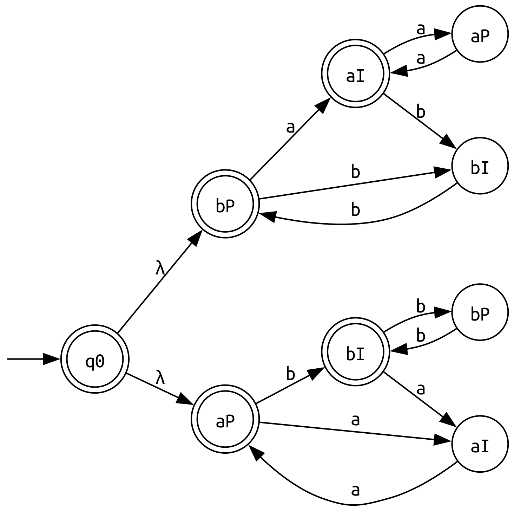

# Práctica 2 / Ejercicio 8

Las cadenas pueden empezar con una cantidad arbitraria de aes o bes. A partir de ahí, en función si consumimos una cantidad par o impar de símbolos, queda determinada la alternancia de aes y bes para que aceptemos el resto de la cadena.

Hay 3 casos para que una cadena $\alpha \in \Sigma^\ast$ sea aceptada:

1. $\alpha$ tiene una cantidad **par de aes** y una cantidad **impar de bes**.
2. $\alpha$ tiene una cantidad **impar de aes** y una cantidad **par de bes**.
3. $\alpha = \lambda$. Si no tiene grupos de repetición entonces también es parte del lenguaje.

Podemos construir 2 AFDs independientes para los casos 1 y 2, y luego conectarlos desde un estado inicial común. El autómata final va a resultar AFND-λ ya que tenemos que inicialmente empezar a recorrer ambos autómatas al mismo tiempo hasta determinar si el primer símbolo es una cantidad par/impar de aes, o una cantidad par/impar de bes. Cuando consumamos la primer alternancia (venimos consumiendo aes y consumimos una b, o viceversa), uno de los autómatas se va a trabar y solo va a poder seguir el que se corresponde con la alternancia requerida para aceptar la cadena.

