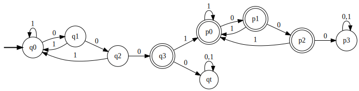
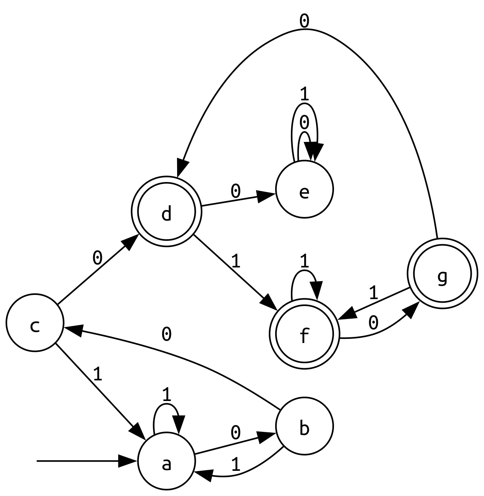

# Práctica 5 / Ejercicio 2

**La mayoría ya son determinísticos y mínimos.** Pero este tiene pinta de que se puede minimizar.

**P2.EJ2.e)** Cadenas que contengan la subcadena 000 exactamente una vez (la cadena 0000 no pertenece a este lenguaje).

Estados | $\equiv_0$ | 0 | 1 | $\equiv_1$ | 0 | 1 | $\equiv_2$ | 0 | 1 | $\equiv_3$ | 0 | 1 | $\equiv_4$
-|-|-|-|-|-|-|-|-|-|-|-|-|-
q0 | NF | NF | NF | A | A | A | 1 | 2 | 1 | Z | Y | Z | a
q1 | NF | NF | NF | A | B | A | 2 | 3 | 1 | Y | X | Z | b
q2 | NF | F  | NF | B | C | A | 3 | 4 | 1 | X | W | Z | c
q3 | F  | NF | F  | C | A | D | 4 | 1 | 5 | W | V | U | d
qt | NF | NF | NF | A | A | A | 1 | 1 | 1 | V | V | V | e
p0 | F  | F  | F  | D | D | D | 5 | 6 | 5 | U | T | U | f
p1 | F  | F  | F  | D | C | D | 6 | 4 | 5 | T | W | U | g
p2 | F  | NF | F  | C | A | D | 4 | 1 | 5 | W | V | U | d
p3 | NF | NF | NF | A | A | A | 1 | 1 | 1 | V | V | V | e

Terminamos porque $(\equiv_3) = (\equiv_4)$. Definimos $M$ AFD mínimo.

$M = (\{ a,b,c,d,e,f,g \}, \{0,1\}, \delta, a, \{d,f,g\})$

$\delta(a, 0) = b \hspace{2em} \delta(a, 1) = a$ \
$\delta(b, 0) = c \hspace{2em} \delta(b, 1) = a$ \
$\delta(c, 0) = d \hspace{2em} \delta(c, 1) = a$ \
$\delta(d, 0) = e \hspace{2em} \delta(d, 1) = f$ \
$\delta(e, 0) = e \hspace{2em} \delta(e, 1) = e$ \
$\delta(f, 0) = g \hspace{2em} \delta(f, 1) = f$ \
$\delta(g, 0) = d \hspace{2em} \delta(g, 1) = f$

